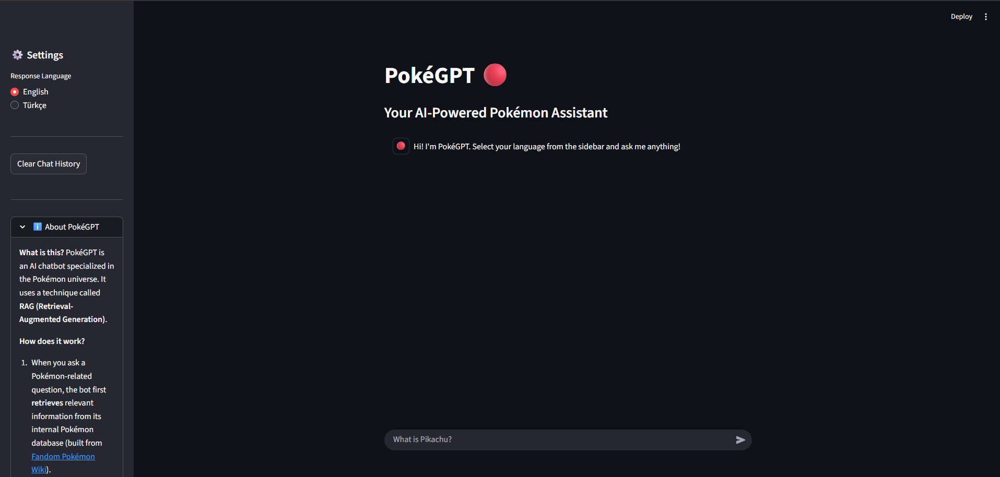

# PokéGPT 🔴 - Akbank GenAI Bootcamp Projesi

 Bu proje, Akbank GenAI Bootcamp: Yeni Nesil Proje Kampı kapsamında geliştirilmiş, RAG (Retrieval-Augmented Generation) mimarisi kullanan bir Pokemon bilgi chatbot'udur. PokéGPT, Pokemon evreni hakkındaki sorulara Fandom Pokemon Wiki veritabanına dayanarak cevaplar üretir ve genel bilgi sorularını da yanıtlayabilir.

## 🚀 Özellikler

* **RAG Mimarisi:** Pokemon ile ilgili sorulara, sağlanan wiki verilerine dayanarak doğru ve bağlamsal cevaplar üretir.
* **Hibrit Cevaplama:** Pokemon dışındaki genel bilgi sorularına GPT-4o-mini'nin kendi bilgisini kullanarak cevap verir.
* **Kaynak Gösterme:** RAG cevaplarının hangi wiki metinlerine dayandığını gösterir.
* **Çok Dilli:** Kenar çubuğundan seçilen dile (İngilizce/Türkçe) göre cevap verir.
* **Akıcı Arayüz:** Streamlit ile geliştirilmiş, sohbet geçmişi tutan ve cevapları akıcı şekilde yazan modern bir web arayüzü.
* **Veri Toplama:** Pokemon ve Yetenek bilgilerini Fandom Wiki'den otomatik olarak çeken Python script'leri içerir.

## 🛠️ Kullanılan Teknolojiler

* **Dil Modeli (LLM):** OpenAI GPT-4o-mini
* **Embedding Modeli:** Sentence Transformers (`all-mpnet-base-v2`)
* **Vektör Veritabanı:** ChromaDB
* **RAG Framework:** LangChain
* **Web Arayüzü:** Streamlit
* **Web Scraping:** Python (`requests`, `BeautifulSoup4`)
* **Programlama Dili:** Python

## 📂 Proje Yapısı
```bash
├──  📄 app.py # Streamlit web uygulaması.
├──  📄 data_wiki_infobox.py # Pokemon ve Yetenek verilerini .txt formatında çeken script.
├──  📄 db_create.py # Vektör veritabanını oluşturan script.
├──  📄 requirements.txt # Gerekli Python kütüphaneleri.
├──  📄 README.md # Bu dosya.
├──  📁 chroma_db/ # Oluşturulan, hazır vektör veritabanı.
└──  📁 images/ # README için görseller (ekran görüntüsü vb.).
          └── 🖼️ pokegpt_screenshot.png
```
## 📹Demo Görüntüleri
- 

- 


## ⚙️ Kurulum ve Çalıştırma

**1. Repoyu Klonlama:**
```bash
git clone https://github.com/whitePhysicS/poke-gpt
cd poke-gpt
```

**2. Sanal Ortam Oluşturma ve Aktifleştirme (Şiddetle Önerilir):**
```bash
python -m venv .venv
# Windows için:
.\venv\Scripts\activate
# macOS/Linux için:
source .venv/bin/activate
```
**3. Gerekli Kütüphanelerin Kurulumu:**
```bash
pip install -r requirements.txt
```

**4. Veri Setini İndirme ve Veritabanını Oluşturma:**
- **ÖNEMLİ⚠️**: Bu proje için gerekli olan veri dosyaları ham haliyle repoya dahil edilmemiştir. Projenin test edilebilmesi için gerekli veritabanı oluşturulmuş ve "**chroma_db**" adlı klasör ile sunulmuştur. Eğer projeyi sadece denemek isterseniz, bu aşamayı atlayabilirsiniz.

- **Veriyi Çekme**: Öncelikle ```data_wiki_infobox.py``` çalıştırılarak demo için hazırlanmış olan "Abilities" (Yetenekler), "Pokedex" (Pokemonların tamamı), verilerinin hepsini ".txt" uzantısı ile indirmeniz gerekmektedir. Script, ```pokemon_data``` isimli bir klasör oluşturup içerisine indirme işlemini gerçekleştirecektir.

- **Veritabanını Oluşturma**: Ardından  
